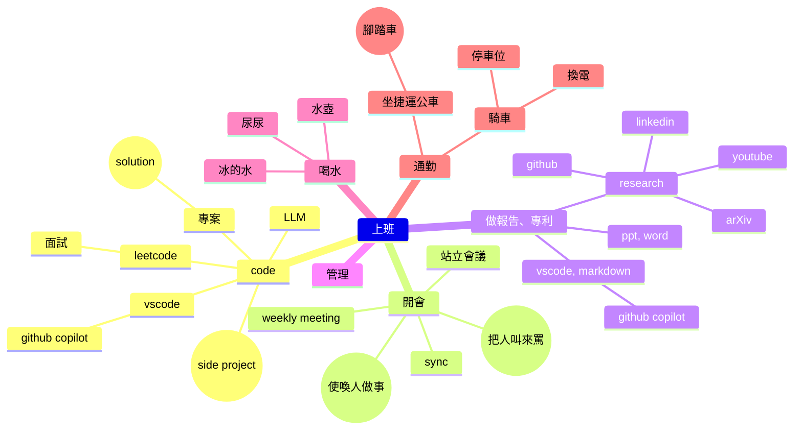
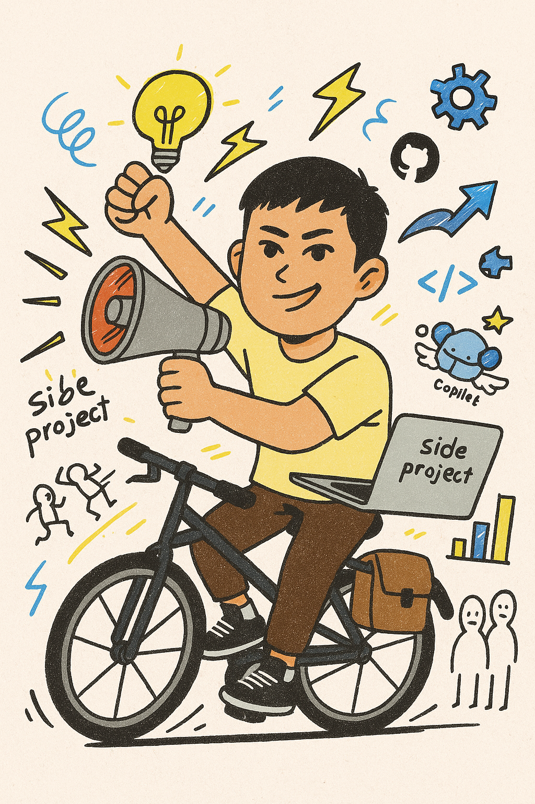
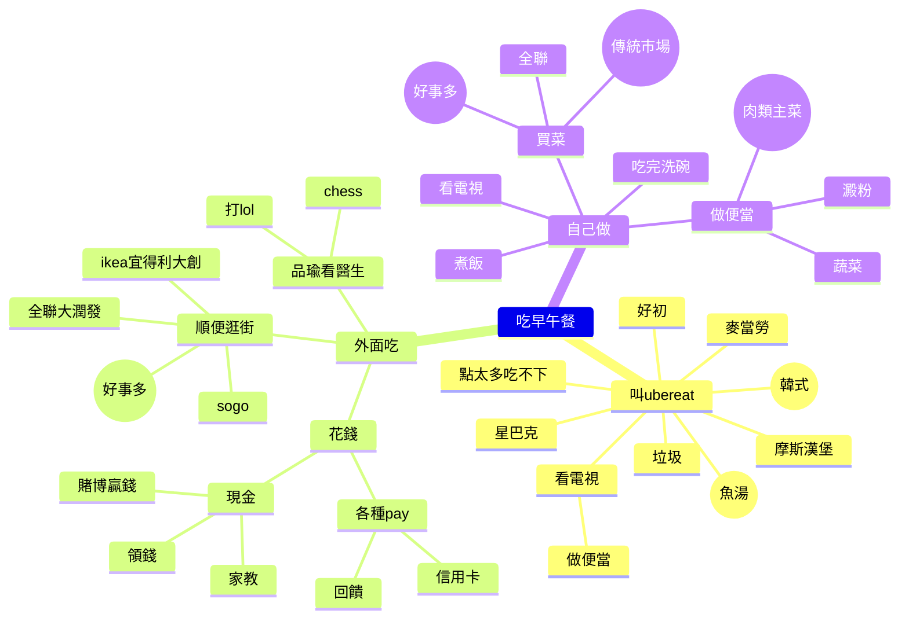
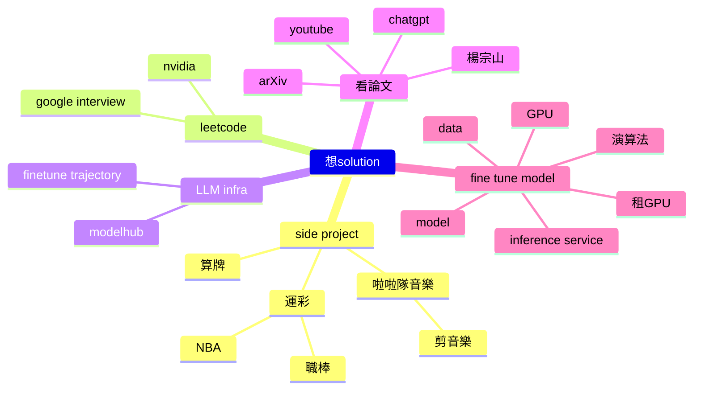

## mindmap

### 專注(投入)

```mermaid
mindmap
    上班
        code
            專案
                fav((solution))
            vscode
                github copilot
            LLM
            fav((side project))
            leetcode
                面試
        開會
            站立會議
            weekly meeting
            sync
            fav((把人叫來罵))
            fav((使喚人做事))
        做報告、專利
            ppt, word
            vscode, markdown
                github copilot
            research
                arXiv
                linkedin
                github
                youtube
        管理
        喝水
            水壺
            冰的水
            尿尿
        通勤
            騎車
                換電
                停車位
            坐捷運公車
                fav((腳踏車))
```

### 精力

```mermaid
mindmap
    吃早午餐
        叫ubereat
            麥當勞
            星巴克
            摩斯漢堡
            好初
            fav((魚湯))
            fav((韓式))
            點太多吃不下
            看電視
                做便當
            垃圾
        外面吃
            花錢
                各種pay
                    信用卡
                    回饋
                現金
                    領錢
                    家教
                    賭博贏錢
            順便逛街
                ikea宜得利大創
                sogo
                fav((好事多))
                全聯大潤發
            品瑜看醫生
                打lol
                chess
        自己做
            買菜
                fav((好事多))
                全聯
                fav((傳統市場))
            煮飯
            吃完洗碗    
            看電視
            做便當
                澱粉
                fav((肉類主菜))
                蔬菜
```

### 心流

```mermaid
mindmap
    想solution
        side project
            運彩
                NBA
                職棒
            算牌
            啦啦隊音樂
                剪音樂
        leetcode
            google interview
            nvidia
        LLM infra
            finetune trajectory
            modelhub
        看論文
            楊宗山
            arXiv
            chatgpt
            youtube
        fine tune model
            租GPU
            GPU
            演算法
            data
            model
            inference service
```